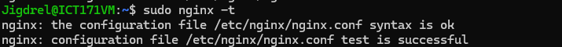
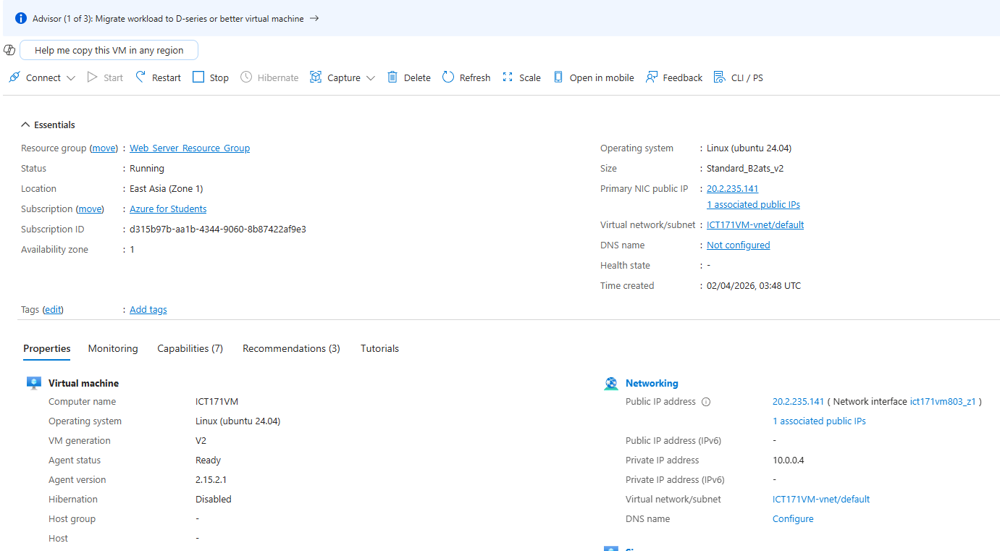
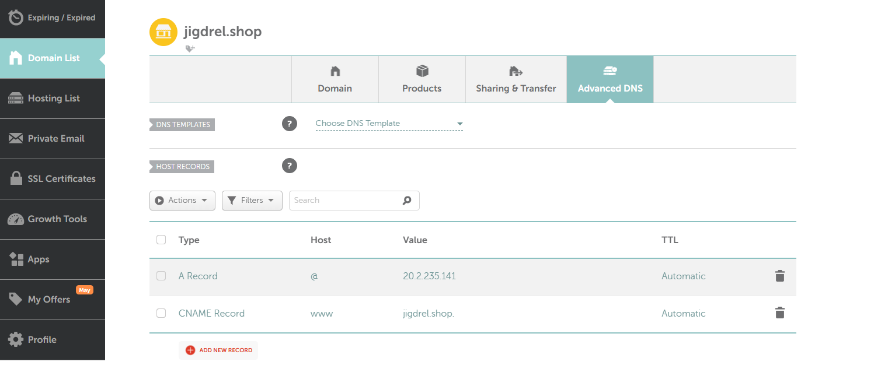
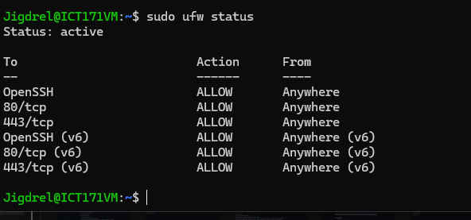
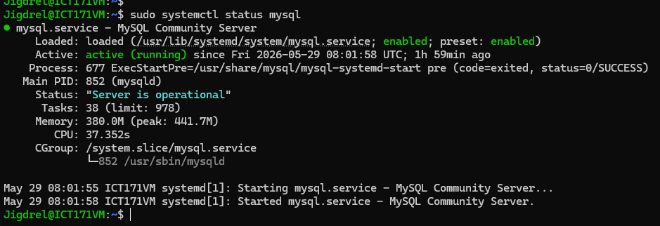
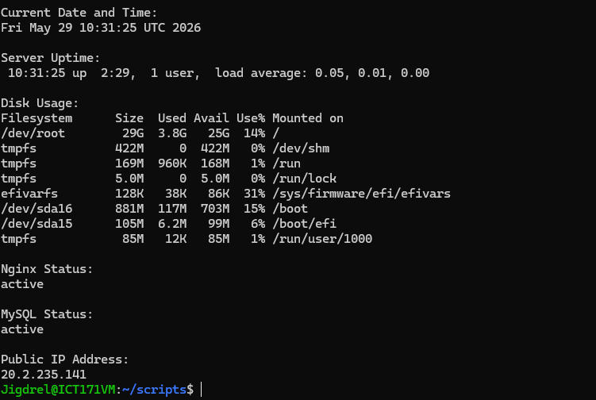

# Cloud Server Documentation
## Jigdrel Sonam Wangchuk (35470585)

## Server Setup
- For my cloud project, I have used IaaS – Microsoft Azure for students VM for hosting the project as Students are offered $100 credit after signing in with student mail. 
- It uses the Linux (Ubuntu 24.04) as the operating system and the location is set to East Asia (Zone 1).
-	The VM generation is V2 and VM architecture is x64.
-	Size: B-Serues, 2vCPUand 1GiB.
-	Public IP is 20.2.235.141 which is provided during the subscription.
-	Create a key pair name and keep the file safe to log into VM.
-	Select inbound port rules and select HTTP (80).
-	Configure the disks with a 30GB OS disk.
-	Keep the network configuration to default and create the VM.

## To Access VM and Install Nginx
[Commands to Access VM and Nginx](commands-access-vm-nginx.md)

## Nginx Status

## VM Overview Configurations

## DNS / Domain Setup
-	I created an account in Namecheap.
-	Purchased the cheapest DNS name (jigdrel.shop) for AUS$0.98
-	From advanced DNS I created an A record, entered in host, entered my IP address in value and set the TTL to automatic.
-	I also created a CNAME Record, entered www in host, entered jigdrel.shop in value and set the TTL to automatic.
-	To test the domain name, I entered my domain name in browser and checked if it shows my page.

## Overview of DNS

## SSL Certificate
- Firstly, to get SSL certificate, open Azure Network Ports, and allow port 22 (For SSH), port 80 (For HTTP) and finally, port 443 (For HTTPS).
- After that, configure ubuntu firewall (UFW).

## To Configure Ubuntu Firewall (UFW)
[Configure Ubuntu Firewall](commands-to-configure-ubuntu-firewall.md)

## UFW Status

## To Create Proper Nginx Server Block
[Create Nginx Server Block](commands-to-create-nginx-block.md)

## Installing additional data base management system (SQL)
- Firstly in order to install SQL, I updated packages.
- Then I installed SQL by writing commands and check if it is running.
- Log into MySQL and creating database.

## To Install MySQL
[Install MySQL](commands-to-install-mysql.md)

## MySQL Status

## Scripts
I have also developed a short script for server status check.

[Script to Check Server Status](scripts-to-check-server-status.md)

## Scrpit Run in VM

